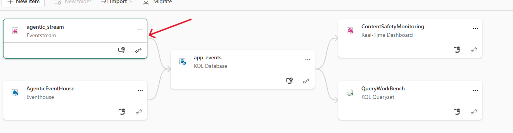

# Testing Real-time Alerting

During the app set up process, we already deployed all required Fabric artifacts, including the required artifacts to enable streaming real-time app usage log. 

While almost all is in place, there are still a few steps remaining to fully set up the end to end process of streaming data and enabling the real-time dashboard for monitoring purposes. 

## Follow below steps to finalize real-time intelligence pipeline in Fabric

### Connect your Eventhouse database to the Eventstream

1. Ensure you have done at least one test run with the application. This enables the streaming pipeline to recognize and map the schema of incoming streaming data.
2. In your Fabric workspace, open your Eventstream artifact. 

    
3. Click on agentic_stream object, click on refresh and ensure there is at least one data entry:
    
4. Now, go back to your workspace, and open the KQL Database object (app_events). On the left side, under KQL databases -> app_events -> Tables there should be a table called agentic_events. Click on "..." -> Get data -> Eventstream -> Existing Eventstream:

    
5. Ensure you choose your current workspace and choose the Eventstream and Stream values as shown in below image. Data connection name can be whatever you wish. Click on Next.

    

6. At this step, the available data entry will be inspected and schema will be shown. Choose "JSON" for the format field so that the process takes less time.

    

7. Click on "Finish". Your KQL database is now successfully wired to get and store data from your EventStream. 

### Query data and add views to the Real-Time Dashboard

1. Go back to your workspace view, and open QueryWorkBench.
    

2. On the left hand side, click on "..." for agent_events table and click on "Refresh database". This is to ensure you are getting the latest data.

    

3. As you can see there are already some example query blocks that you can choose and run. You can click on any of them and add it as a view to the existing ContentSafetyMonitoring dashboard. 

    

    You can also write new queries, and add them to the existing dashboard or create a new one.